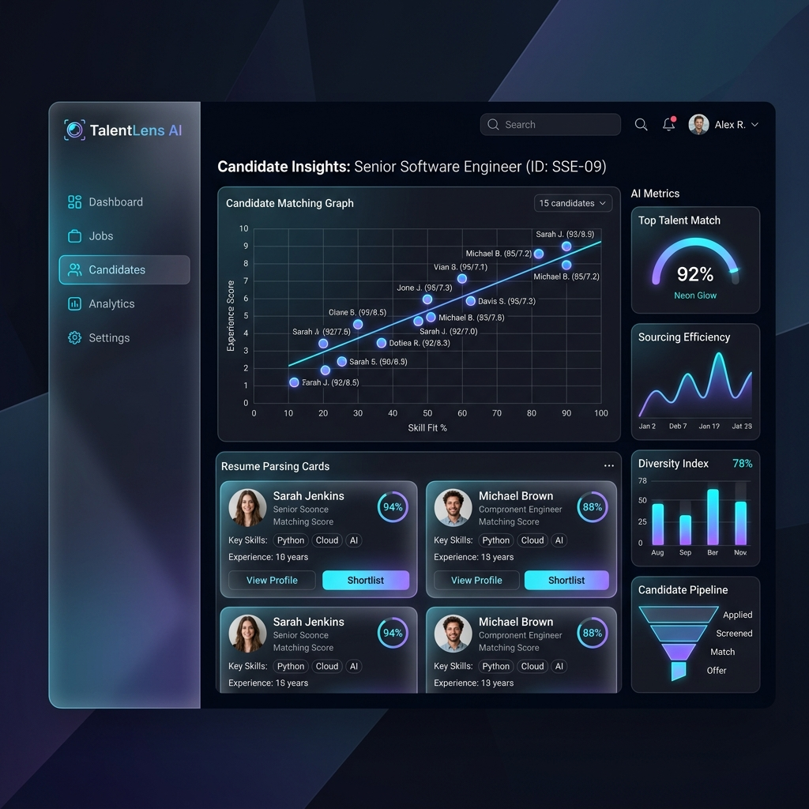
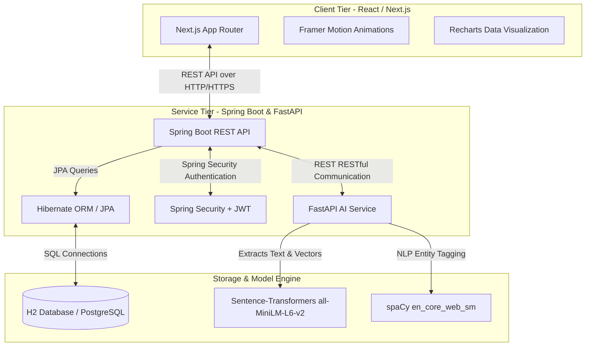
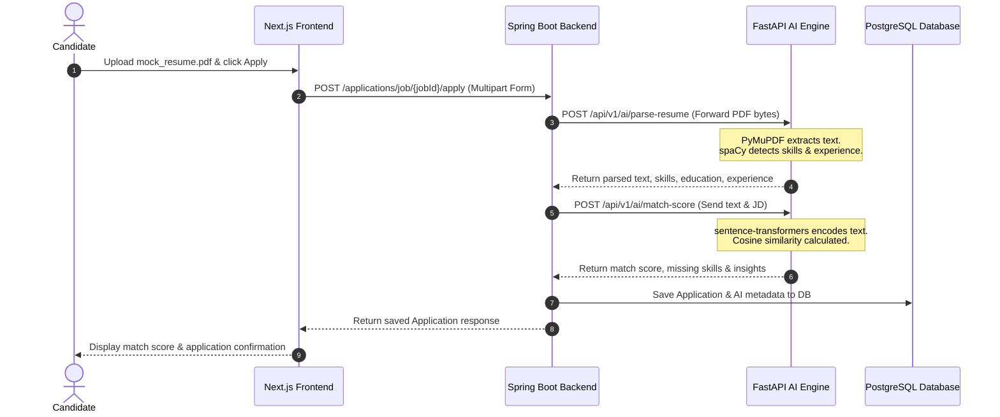
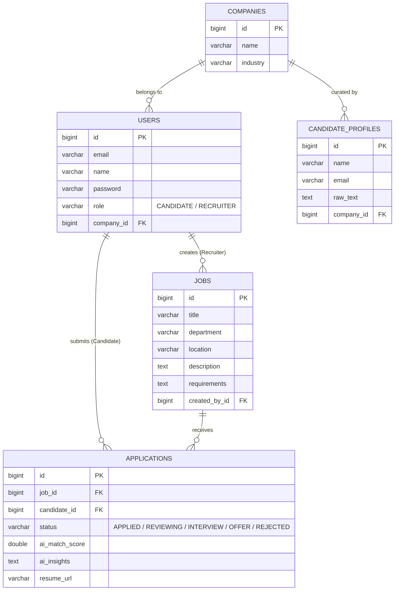

# 🌌 TalentLens: Next-Generation AI-Powered Recruitment Platform

TalentLens is a state-of-the-art, enterprise-grade talent acquisition and candidate matching system. By leveraging local semantic embedding engines, Named Entity Recognition (NER), and a fully decoupled modern web architecture, TalentLens automates the labor-intensive stages of recruiting: parsing resumes, analyzing candidate-to-job matches, and generating customized technical and behavioral interview questions.



---

## 📋 Table of Contents

1. [System Overview & Key Features](#system-overview--key-features)
2. [High-Level System Architecture](#high-level-system-architecture)
3. [Technology Stack](#technology-stack)
4. [Project Directory Structures](#project-directory-structures)
5. [Database Schema & Data Models](#database-schema--data-models)
6. [Detailed REST API Specifications](#detailed-rest-api-specifications)
7. [AI Engine: Text Parsing & Semantic Matching Pipeline](#ai-engine-text-parsing--semantic-matching-pipeline)
8. [Local Installation & Development Setup](#local-installation--development-setup)
9. [End-to-End Test Workflow](#end-to-end-test-workflow)
10. [UI/UX Design Tokens & Core Components](#uiux-design-tokens--core-components)
11. [Docker Containerization (Production Deployment)](#docker-containerization-production-deployment)
12. [Troubleshooting Guide](#troubleshooting-guide)
13. [Future Development Roadmap](#future-development-roadmap)
14. [Licensing & Contributions](#licensing--contributions)

---

## 🎯 System Overview & Key Features

*   **Semantic Match Engine:** Utilizes Sentence-Transformer dense vector embeddings to calculate cosine similarity scores between candidate profiles and job descriptions, moving beyond simple keyword matching.
*   **Heuristic-NER Hybrid Parser:** Employs the `spaCy` NLP model along with customized date-range and section detectors to extract skills, education, and career experience from uploaded PDFs.
*   **Personalized Interview Generator:** Creates context-aware technical and behavioral interview questions mapped directly to the candidate's experience and the specific requirements of the job.
*   **Live Analytics Dashboard:** Interactive data visualization highlighting candidate quality distributions, hiring funnel progression, and job market breakdown.
*   **Stateless JWT Security:** Full authentication suite utilizing Spring Security and JWT tokens to separate Recruiter and Candidate permissions.
*   **H2/PostgreSQL Profiles:** Seamless environment shifting between developer-friendly in-memory testing and robust, production-ready PostgreSQL persistence.

---

## 🏛️ High-Level System Architecture

TalentLens is built on a clean, three-tier microservice architecture:



### 1. Data Flow: Application & Resume Scoring Pipeline
When a candidate submits their application with a resume PDF, the system triggers the following data pipeline:



---

## 💻 Technology Stack

| Layer | Component | Technology / Library | Version | Description |
| :--- | :--- | :--- | :--- | :--- |
| **Frontend** | Core | React | 19.x | Component-based view layer |
| **Frontend** | Framework | Next.js (App Router) | 16.x | SSR, static generation, and routing |
| **Frontend** | Styling | Tailwind CSS | 4.x | Utility-first styling framework |
| **Frontend** | Animation | Framer Motion | 12.x | Fluid micro-animations and page transitions |
| **Frontend** | Charts | Recharts | 3.x | SVG-based responsive data visualization |
| **Backend** | Framework | Spring Boot | 4.x | Enterprise application container |
| **Backend** | Security | Spring Security + JWT | 6.x / 0.12 | Authentication & Role-based Authorization |
| **Backend** | Database | Hibernate / Spring Data JPA | 4.x | Relational mapping and repository pattern |
| **Backend** | Dev Database | H2 Database | 2.x | In-memory transactional database for dev |
| **Backend** | Prod Database| PostgreSQL | 16.x | Production persistent object-relational DB |
| **AI Service**| Framework | FastAPI | 0.103.x | Async Python web framework for microservices |
| **AI Service**| Server | Uvicorn | 0.23.x | ASGI web server implementation |
| **AI Service**| PDF Parser | PyMuPDF | 1.23.x | PDF document text extraction engine |
| **AI Service**| NLP Engine | spaCy | 3.7.x | Industrial-strength Natural Language Processing |
| **AI Service**| Embeddings | sentence-transformers | 2.2.x | Text embedding models (all-MiniLM-L6-v2) |

---

## 📁 Project Directory Structures

### 1. Spring Boot Backend Structure
```
talentlens-backend/
├── .mvn/
├── src/
│   ├── main/
│   │   ├── java/com/talentlens/
│   │   │   ├── TalentlensApiApplication.java
│   │   │   ├── ai/
│   │   │   │   └── AIClientService.java                # FastAPI REST communications
│   │   │   ├── config/
│   │   │   │   ├── CorsConfig.java
│   │   │   │   ├── RestTemplateConfig.java
│   │   │   │   └── SecurityConfig.java                 # Web security policies & filter registration
│   │   │   ├── controller/
│   │   │   │   ├── ApplicationController.java          # Job application submit & status APIs
│   │   │   │   ├── AuthController.java                 # Login & Registration endpoints
│   │   │   │   ├── CandidateProfileController.java     # Recruiter-managed talent pool APIs
│   │   │   │   └── JobController.java                  # Job creation & management endpoints
│   │   │   ├── dto/
│   │   │   │   ├── ApplicationResponse.java
│   │   │   │   ├── AuthResponse.java
│   │   │   │   ├── CandidateProfileRequest.java
│   │   │   │   ├── CandidateProfileResponse.java
│   │   │   │   ├── JobRequest.java
│   │   │   │   ├── JobResponse.java
│   │   │   │   ├── LoginRequest.java
│   │   │   │   └── RegisterRequest.java
│   │   │   ├── entity/
│   │   │   │   ├── Application.java                    # Application JPA mapping
│   │   │   │   ├── CandidateProfile.java               # Talent pool profiles
│   │   │   │   ├── Company.java                        # Client company entity
│   │   │   │   ├── Job.java                            # Job listing entity
│   │   │   │   ├── Role.java                           # CANDIDATE, RECRUITER enum
│   │   │   │   └── User.java                           # System user credentials
│   │   │   ├── repository/
│   │   │   │   ├── ApplicationRepository.java
│   │   │   │   ├── CandidateProfileRepository.java
│   │   │   │   ├── CompanyRepository.java
│   │   │   │   ├── JobRepository.java
│   │   │   │   └── UserRepository.java
│   │   │   └── security/
│   │   │       ├── CustomUserDetailsService.java
│   │   │       ├── JwtAuthenticationFilter.java        # Security filter validating Bearer tokens
│   │   │       └── JwtTokenProvider.java               # Sign & verify token signatures
│   │   └── resources/
│   │       ├── application.properties                  # Legacy properties configuration
│   │       └── application.yml                         # Multi-profile H2/PostgreSQL YAML setup
│   └── test/
├── mvnw
├── mvnw.cmd
└── pom.xml                                             # Project Object Model dependencies
```

### 2. Next.js Frontend Structure
```
talentlens-frontend/
├── app/
│   ├── (auth)/
│   │   ├── layout.tsx                                  # Centered layouts for login
│   │   ├── forgot-password/
│   │   │   └── page.tsx
│   │   ├── login/
│   │   │   └── page.tsx                                # Custom glassmorphic login form
│   │   └── register/
│   │       └── page.tsx                                # Toggle user role registrations
│   ├── (marketing)/
│   │   ├── layout.tsx
│   │   └── page.tsx                                    # Marketing/Landing presentation
│   ├── (recruiter)/
│   │   ├── layout.tsx                                  # Sidebar integration layout
│   │   ├── analytics/
│   │   │   └── page.tsx                                # Recharts charts visual dashboards
│   │   ├── candidates/
│   │   │   ├── page.tsx                                # Talent Pool list page
│   │   │   ├── new/
│   │   │   │   └── page.tsx                            # Manual profile builder
│   │   │   └── [id]/
│   │   │       └── page.tsx                            # Candidate profile detail page
│   │   ├── dashboard/
│   │   │   └── page.tsx                                # Recruiter quick summary view
│   │   ├── interviews/
│   │   │   └── page.tsx                                # Interview scheduler & controller
│   │   └── jobs/
│   │       ├── page.tsx                                # Job posts overview
│   │       └── new/
│   │           └── page.tsx                            # Dynamic job creation forms
│   ├── layout.tsx                                      # Root layout containing HTML metadata
│   └── providers.tsx                                   # ReactQuery & Theme context wraps
├── components/
│   ├── candidates/
│   │   └── CandidateCard.tsx                           # Grid cards for candidates
│   ├── dashboard/
│   │   ├── CandidateQualityChart.tsx
│   │   ├── Header.tsx                                  # Dashboard actions navbar
│   │   ├── HiringFunnelChart.tsx
│   │   ├── Sidebar.tsx                                 # Left navigation drawer
│   │   └── StatsCard.tsx                               # Grid layout dashboard statistics
│   ├── jobs/
│   │   └── JobCard.tsx
│   ├── marketing/
│   │   ├── CTASection.tsx
│   │   ├── FeaturesSection.tsx
│   │   ├── Footer.tsx
│   │   ├── HeroSection.tsx
│   │   ├── Navbar.tsx
│   │   └── TrustSection.tsx
│   ├── shared/
│   │   ├── GradientText.tsx
│   │   ├── MagneticButton.tsx
│   │   └── ParticleField.tsx                           # Dynamic canvas particle simulation
│   └── ui/                                             # Primitive Shadcn elements
│       ├── avatar.tsx
│       ├── badge.tsx
│       ├── button.tsx
│       ├── card.tsx
│       ├── dropdown-menu.tsx
│       ├── input.tsx
│       ├── label.tsx
│       ├── progress.tsx
│       └── table.tsx
├── package.json
└── tsconfig.json
```

### 3. FastAPI AI Engine Structure
```
talentlens-ai/
├── app/
│   ├── api/
│   │   └── router.py                                   # Endpoint handler bindings
│   ├── core/
│   │   └── models.py                                   # Pydantic schema validation structures
│   ├── services/
│   │   ├── embedding_engine.py                         # Hugging Face transformers embeddings
│   │   ├── insight_generator.py                        # Rule-based insights & question generation
│   │   ├── resume_parser.py                            # PyMuPDF bytes converter
│   │   └── skill_extractor.py                          # spaCy NER pipeline & blocklist filters
│   └── main.py                                         # FastAPI app initiation, CORS configuration
├── venv/                                               # Python virtual environment directory
└── requirements.txt                                    # Python dependencies definition
```

---

## 🗄️ Database Schema & Data Models

The system architecture utilizes a relational database mapped via Hibernate JPA entities.



### Entity Fields Description & Mapping

#### 1. User Entity ([User.java](file:///d:/Desktop/ai-powered/talentlens-backend/src/main/java/com/talentlens/entity/User.java))
Represents candidate and recruiter authentication credentials.
*   `id` (BigInt, Primary Key, Auto-Increment)
*   `name` (Varchar, Not Null): User's full display name.
*   `email` (Varchar, Unique, Not Null): Serves as authentication username.
*   `password` (Varchar, Not Null): Encrypted bcrypt password.
*   `role` (Enum/Varchar): Values: `CANDIDATE`, `RECRUITER`.
*   `company` (ManyToOne, Lazy, Optional): Mapped if user is a Recruiter.

#### 2. Job Entity ([Job.java](file:///d:/Desktop/ai-powered/talentlens-backend/src/main/java/com/talentlens/entity/Job.java))
Contains requirements and details for job openings created by Recruiters.
*   `id` (BigInt, Primary Key, Auto-Increment)
*   `title` (Varchar, Not Null): E.g. "Senior React Developer".
*   `department` (Varchar): E.g. "Engineering".
*   `location` (Varchar): E.g. "Remote", "New York".
*   `description` (Text): Full markdown description of the role.
*   `requirements` (Text): Text summary of minimum credentials required.
*   `createdBy` (ManyToOne, Lazy, Not Null): Links to the Recruiter `User` who posted the job.

#### 3. Application Entity ([Application.java](file:///d:/Desktop/ai-powered/talentlens-backend/src/main/java/com/talentlens/entity/Application.java))
Connects a candidate's submission to a job, storing parsed files and AI results.
*   `id` (BigInt, Primary Key, Auto-Increment)
*   `job` (ManyToOne, Lazy, Not Null): Reference to the applied `Job`.
*   `candidate` (ManyToOne, Lazy, Not Null): Reference to the Candidate `User`.
*   `status` (Varchar): E.g., `APPLIED`, `REVIEWING`, `INTERVIEW`, `OFFER`, `REJECTED`.
*   `aiMatchScore` (Double): Calculated cosine similarity percentage (0-100).
*   `aiInsights` (Text): Serialized JSON from the AI engine detailing missing skills and match reasoning.
*   `resumeUrl` (Varchar): Storage location path of the resume PDF.

---

## 🔌 Detailed REST API Specifications

The Spring Boot backend serves RESTful JSON endpoints. All administrative endpoints require a JWT token passed inside the `Authorization: Bearer <TOKEN>` header.

### 1. Authentication Services

#### POST `/api/v1/auth/register`
Creates a new system user profile.
*   **Request Body:**
    ```json
    {
      "name": "Jane Recruiter",
      "email": "jane@company.com",
      "password": "securepassword123",
      "role": "RECRUITER",
      "companyName": "Tech Industries"
    }
    ```
*   **Response Body (200 OK):**
    ```json
    {
      "id": 1,
      "token": "eyJhbGciOiJIUzI1NiJ9.ey...",
      "email": "jane@company.com",
      "role": "RECRUITER",
      "name": "Jane Recruiter"
    }
    ```

#### POST `/api/v1/auth/login`
Validates user credentials and issues a JWT token.
*   **Request Body:**
    ```json
    {
      "email": "jane@company.com",
      "password": "securepassword123"
    }
    ```
*   **Response Body (200 OK):**
    ```json
    {
      "id": 1,
      "token": "eyJhbGciOiJIUzI1NiJ9.ey...",
      "email": "jane@company.com",
      "role": "RECRUITER",
      "name": "Jane Recruiter"
    }
    ```

---

### 2. Job Board Management

#### GET `/api/v1/jobs`
Lists all active job postings on the platform. Anonymous read allowed.
*   **Response Body (200 OK):**
    ```json
    [
      {
        "id": 5,
        "title": "Senior Full Stack Engineer",
        "department": "Engineering",
        "location": "Remote",
        "description": "...",
        "requirements": "...",
        "recruiterId": 1
      }
    ]
    ```

#### POST `/api/v1/jobs`
Creates a new job listing. Recruiter authentication required.
*   **Request Body:**
    ```json
    {
      "title": "Backend Architect",
      "department": "Infrastructure",
      "location": "Boston, MA",
      "description": "Design secure and scalable APIs.",
      "requirements": "Java, Go, Kubernetes, PostgreSQL"
    }
    ```
*   **Response Body (200 OK):**
    ```json
    {
      "id": 6,
      "title": "Backend Architect",
      "department": "Infrastructure",
      "location": "Boston, MA",
      "description": "Design secure and scalable APIs.",
      "requirements": "Java, Go, Kubernetes, PostgreSQL",
      "recruiterId": 1
    }
    ```

---

### 3. Application Submission & Review

#### POST `/api/v1/applications/job/{jobId}/apply`
Candidate submits a job application along with their resume. Candidate authentication required.
*   **Form-Data parameters:**
    *   `resume` (File, binary PDF file)
    *   `candidateId` (String/Long value)
*   **Response Body (200 OK):**
    ```json
    {
      "id": 2,
      "jobId": 5,
      "jobTitle": "Senior Full Stack Engineer",
      "candidateId": 2,
      "candidateName": "John Doe",
      "status": "APPLIED",
      "aiMatchScore": 76.45,
      "aiInsights": "{\"match_score\": 76.45, \"missing_skills\": [\"Docker\"], \"ai_quality_insights\": \"Strong candidate...\"}",
      "resumeUrl": "/uploads/mock_resume.pdf"
    }
    ```

#### GET `/api/v1/applications/job/{jobId}`
Fetches all applications submitted to a specific job listing. Recruiter authentication required.
*   **Response Body (200 OK):**
    ```json
    [
      {
        "id": 2,
        "jobId": 5,
        "jobTitle": "Senior Full Stack Engineer",
        "candidateId": 2,
        "candidateName": "John Doe",
        "status": "APPLIED",
        "aiMatchScore": 76.45,
        "aiInsights": "...",
        "resumeUrl": "/uploads/mock_resume.pdf"
      }
    ]
    ```

#### GET `/api/v1/applications/{applicationId}/interview-questions`
Generates customized interview questions based on the candidate's resume and job requirements.
*   **Response Body (200 OK):**
    ```json
    {
      "questions": [
        {
          "type": "TECHNICAL",
          "question": "Can you describe a complex problem you solved using Spring Boot?"
        },
        {
          "type": "BEHAVIORAL",
          "question": "Tell me about a time you had to prioritize tasks when you had multiple competing deadlines."
        }
      ]
    }
    ```

---

## 🧠 AI Engine: Text Parsing & Semantic Matching Pipeline

The FastAPI microservice ([talentlens-ai](file:///d:/Desktop/ai-powered/talentlens-ai)) performs high-performance NLP computations locally, avoiding external network latency and ensuring candidate data privacy.

```
       Candidate PDF Upload
                │
                ▼
       ┌──────────────────┐
       │   PyMuPDF Engine │  <─── Extracts plain text from bytes
       └──────────────────┘
                │
                ▼
       ┌──────────────────┐
       │    spaCy NER     │  <─── Sections parsed via Regex; Filter blocklist removes false ORGs
       └──────────────────┘
                │
                ▼
       ┌──────────────────┐
       │  MiniLM Embedder │  <─── Encodes Resume & Job Description into dense vector embeddings
       └──────────────────┘
                │
                ▼
       ┌──────────────────┐
       │Cosine Similarity │  <─── dot(A, B) / (||A|| * ||B||) -> Score out of 100
       └──────────────────┘
```

### 1. Document Extraction (`PyMuPDF`)
The raw bytes of uploaded PDF resumes are parsed in memory using PyMuPDF:
```python
import fitz # PyMuPDF
doc = fitz.open(stream=file_bytes, filetype="pdf")
text = ""
for page in doc:
    text += page.get_text()
```
This extracted text is returned as a plain UTF-8 string to the NLP processing pipeline.

### 2. Entity Extraction (`spaCy`)
The text is passed to the NLP model `en_core_web_sm` to identify named entities.
*   **Skill Extraction:** Curated dictionary matching searches the raw text for common technical keywords.
*   **Experience & Education Extraction:**
    *   **Strategy 1 (Section Parser):** Scans lines inside designated "Experience" sections for date patterns (e.g. `2018 - 2021` or `Jan 2020 - Present`) to identify employment history.
    *   **Strategy 2 (NER Fallback):** Collects entities flagged as `ORG` by spaCy, filtering out common technologies and false positives using a strict blocklist:
        ```python
        ORG_BLOCKLIST = {"sqlite", "unity", "mysql", "postgresql", "react", "git", "aws", "data science"}
        ```

### 3. Semantic Embedding Engine (`all-MiniLM-L6-v2`)
Rather than relying solely on keyword counts (which candidates can easily manipulate), TalentLens uses sentence embeddings to compare profiles.
*   **Model:** `all-MiniLM-L6-v2` encodes raw text into a 384-dimensional dense vector space.
*   **Similarity Computation:** Calculates the cosine similarity between the resume vector ($V_{resume}$) and the job description vector ($V_{jd}$):

$$\text{Cosine Similarity} = \frac{\mathbf{V}_{resume} \cdot \mathbf{V}_{jd}}{\|\mathbf{V}_{resume}\| \|\mathbf{V}_{jd}\|}$$

```python
similarity = np.dot(resume_emb, jd_emb) / (np.linalg.norm(resume_emb) * np.linalg.norm(jd_emb))
score = max(0.0, float(similarity) * 100)
```
This mathematical approach evaluates structural context and synonyms (e.g. mapping "Node.js" closely to "Backend engineering").

---

## 🛠️ Local Installation & Development Setup

### 📋 Prerequisites Verification
Ensure your developer machine environment has:
```bash
# Check Java Compiler (Target: 17 or higher)
javac -version

# Check Node runtime (Target: 18 or higher)
node -v

# Check Python runtime (Target: 3.8 or higher)
python --version
```

---

### Step 1: Start the AI Service (FastAPI)
The AI service must run on port **8001** for backend compatibility.

1.  Navigate to the AI service directory:
    ```bash
    cd talentlens-ai
    ```
2.  Set up the Python virtual environment:
    ```bash
    # Create environment
    python -m venv venv
    
    # Activate environment (Windows PowerShell)
    .\venv\Scripts\activate
    
    # Activate environment (Mac / Linux)
    source venv/bin/activate
    ```
3.  Install dependencies:
    ```bash
    pip install -r requirements.txt
    ```
4.  Start the development server:
    ```bash
    uvicorn app.main:app --reload --port 8001
    ```
5.  Verify the service status:
    ```bash
    curl http://localhost:8001/health
    # Response: {"status": "ok"}
    ```

---

### Step 2: Start the Backend (Spring Boot)
The Spring Boot server starts on port **8080** by default.

1.  Navigate to the backend directory:
    ```bash
    cd talentlens-backend
    ```
2.  Compile resources and start using the Maven wrapper:
    ```bash
    # Windows Command Prompt / PowerShell
    .\mvnw.cmd spring-boot:run
    
    # Mac / Linux
    ./mvnw spring-boot:run
    ```
3.  Verify the backend console:
    Open `http://localhost:8080/h2-console` in your browser.
    *   **JDBC URL:** `jdbc:h2:mem:talentlensdb`
    *   **User Name:** `sa`
    *   **Password:** (leave blank)

---

### Step 3: Start the Frontend (Next.js)
The frontend starts on port **3000** and connects to the backend at port 8080.

1.  Navigate to the frontend directory:
    ```bash
    cd talentlens-frontend
    ```
2.  Install packages:
    ```bash
    npm install
    ```
3.  Start the local dev server:
    ```bash
    npm run dev
    ```
4.  Open `http://localhost:3000` to access the application.

---

## 🧪 End-to-End Test Workflow

The root folder contains a testing script, [test_e2e.py](file:///d:/Desktop/ai-powered/test_e2e.py), that runs the entire registration, job post, PDF resume upload, match score calculation, and interview question generation pipeline.

### Running the Test
With all three services running, run the following command in a new terminal:
```bash
# Navigate to project root
cd d:\Desktop\ai-powered

# Run the end-to-end test script
python test_e2e.py
```

### Expected Console Output:
```text
========================================
TALENTLENS E2E INTEGRATION TEST
========================================

1. Registering Recruiter...
Status Code: 200
Response: {"id":1,"token":"eyJhbGciOiJIUzI1NiJ9...","email":"recruiter_1717511000@example.com","role":"RECRUITER","name":"Jane Recruiter"}
Success! Token length: 154

2. Registering Candidate...
Success! Candidate ID: 2

3. Creating Job (as Recruiter)...
Job Status Code: 200
Job Response: {"id":1,"title":"Senior Full Stack Engineer","department":"Engineering","location":"Remote","description":"...","requirements":"..."}
✅ Success! Job ID: 1

4. Submitting Application & Calling AI Service...
This step automatically calls FastAPI to parse the PDF and generate match scores.
✅ Application submitted successfully!
   AI Match Score: 76.45%

5. Fetching AI Interview Questions (as Recruiter)...
✅ Success! Generated 5 interview questions.
   Q1 [TECHNICAL]: Can you describe a complex problem you solved using React?
   Q2 [TECHNICAL]: How do you ensure code quality and performance in your technical projects?
   ...

🎉 ALL E2E TESTS PASSED! FULL PIPELINE VERIFIED! 🎉
```

---

## 🎨 UI/UX Design Tokens & Core Components

TalentLens features a modern, dark-themed, glassmorphic user interface.

### 1. Typography & Colors
*   **Fonts:** `Geist Sans` (for clean, readable body copy) and `Geist Mono` (for code displays).
*   **Color Palette (Dark Mode):**
    *   **Background:** `#000000` (deep black) & `#0a0a0a` (charcoal background)
    *   **Card Fill:** `#121212` with `10px` blur and `rgba(255,255,255,0.06)` border.
    *   **Accent Green:** `#4ADE80` (neon mint green for scores and indicators)
    *   **Accent Violet:** `#A855F7` (royal purple for headers and action items)

### 2. High-Performance Shared Canvas Components
The frontend utilizes custom Canvas components to create immersive visual environments:
*   [ParticleField.tsx](file:///d:/Desktop/ai-powered/talentlens-frontend/components/shared/ParticleField.tsx): Generates interactive background particles using the HTML5 Canvas API.
*   [MagneticButton.tsx](file:///d:/Desktop/ai-powered/talentlens-frontend/components/shared/MagneticButton.tsx): Attracts the user's cursor dynamically using spring animations.
*   [GradientText.tsx](file:///d:/Desktop/ai-powered/talentlens-frontend/components/shared/GradientText.tsx): Renders styled text gradients using Tailwind utility classes.

---

## 🐳 Docker Containerization (Production Deployment)

For production environments, you can run TalentLens in containerized environments.

### 1. Frontend Dockerfile (`talentlens-frontend/Dockerfile`)
```dockerfile
FROM node:18-alpine AS base
WORKDIR /app
COPY package*.json ./
RUN npm ci
COPY . .
RUN npm run build

FROM node:18-alpine AS runner
WORKDIR /app
ENV NODE_ENV=production
COPY --from=base /app/package.json ./
COPY --from=base /app/.next ./.next
COPY --from=base /app/public ./public
COPY --from=base /app/node_modules ./node_modules
EXPOSE 3000
CMD ["npm", "start"]
```

### 2. Backend Dockerfile (`talentlens-backend/Dockerfile`)
```dockerfile
FROM maven:3.9-eclipse-temurin-17-alpine AS build
WORKDIR /app
COPY pom.xml .
COPY src ./src
RUN mvn clean package -DskipTests

FROM eclipse-temurin:17-jre-alpine
WORKDIR /app
COPY --from=build /app/target/*.jar app.jar
ENV SPRING_PROFILES_ACTIVE=prod
EXPOSE 8080
ENTRYPOINT ["java", "-jar", "app.jar"]
```

### 3. AI Service Dockerfile (`talentlens-ai/Dockerfile`)
```dockerfile
FROM python:3.11-slim
WORKDIR /app
COPY requirements.txt .
RUN pip install --no-cache-dir -r requirements.txt
RUN python -m spacy download en_core_web_sm
COPY . .
EXPOSE 8001
CMD ["uvicorn", "app.main:app", "--host", "0.0.0.0", "--port", "8001"]
```

### 4. Orchestration (`docker-compose.yml`)
To start the entire cluster in production mode, create the following configuration in the root directory:
```yaml
version: '3.8'

services:
  database:
    image: postgres:16-alpine
    container_name: talentlens-db
    environment:
      POSTGRES_DB: talentlens
      POSTGRES_USER: postgres
      POSTGRES_PASSWORD: production_password
    ports:
      - "5432:5432"
    volumes:
      - pgdata:/var/lib/postgresql/data

  ai-service:
    build: ./talentlens-ai
    container_name: talentlens-ai-engine
    ports:
      - "8001:8001"
    environment:
      - PORT=8001

  backend:
    build: ./talentlens-backend
    container_name: talentlens-backend-api
    ports:
      - "8080:8080"
    environment:
      - DATABASE_URL=jdbc:postgresql://database:5432/talentlens
      - DATABASE_USERNAME=postgres
      - DATABASE_PASSWORD=production_password
    depends_on:
      - database
      - ai-service

  frontend:
    build: ./talentlens-frontend
    container_name: talentlens-web-client
    ports:
      - "3000:3000"
    environment:
      - NEXT_PUBLIC_API_URL=http://backend:8080/api/v1
    depends_on:
      - backend

volumes:
  pgdata:
```
Run `docker-compose up --build -d` to launch all services.

---

## 🔍 Troubleshooting Guide

| Issue | Root Cause | Solution |
| :--- | :--- | :--- |
| **H2 Console shows Table Not Found** | Incorrect JDBC URL in login panel | Ensure the JDBC connection string is set to `jdbc:h2:mem:talentlensdb`. |
| **FastAPI fails with OSError regarding spaCy** | The language model is missing in Python | Run `python -m spacy download en_core_web_sm` manually in the virtual environment. |
| **FastAPI Address already in use (8001)** | A background process is already using port 8001 | Check and terminate any active processes using `netstat -ano \| findstr 8001` (Windows) or `lsof -i :8001` (Mac). |
| **Next.js throws CORS errors on REST calls** | Misconfigured cross-origin rules | Verify that [CorsConfig.java](file:///d:/Desktop/ai-powered/talentlens-backend/src/main/java/com/talentlens/config/CorsConfig.java) permits calls from `http://localhost:3000`. |
| **Maven build fails due to Lombok annotations** | Lombok processor isn't configured in javac compiler path | Enable annotation processing in your IDE settings and verify that Lombok is configured in the `pom.xml` compiler plugin settings. |
| **PDF parsing returns empty text** | Scanned PDF without text layer (OCR required) | Ensure the uploaded file has a valid digital text layer. Add OCR capability to the FastAPI pipeline as a fallback. |

---

## 🗺️ Future Development Roadmap

*   **Integrate Google Gemini API:** Transition from rule-based scoring heuristics to LLM-driven assessments.
*   **Interactive Coding Sandbox:** Allow candidates to complete assessments within the platform and have their code scored by the AI.
*   **Automatic Outlook/Google Calendar Sync:** Let recruiters book interview slots directly through the application page.
*   **Collaborative Recruiter Notes:** Add shared discussion feeds to applicant profiles for panel evaluations.
*   **Voice Analytics for Interviews:** Provide AI feedback on candidate speech speed, hesitation patterns, and keyword alignment during mock interviews.

---

## 📄 Licensing & Contributions

TalentLens is released under the **MIT License**.

### Contributions Guidelines:
1.  Fork the repository.
2.  Create a feature branch: `git checkout -b feature/amazing-ai-addition`.
3.  Commit your modifications: `git commit -m "feat: integrate gemini model"`.
4.  Push to the origin branch: `git push origin feature/amazing-ai-addition`.
5.  Open a Pull Request.

---

*Developed by the TalentLens Product and Engineering Teams.*
